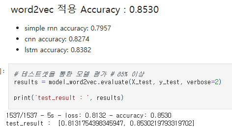
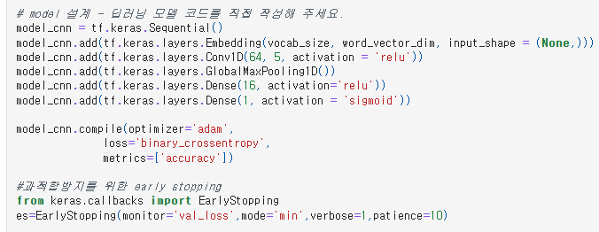
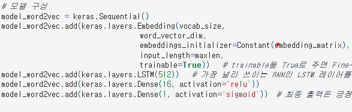
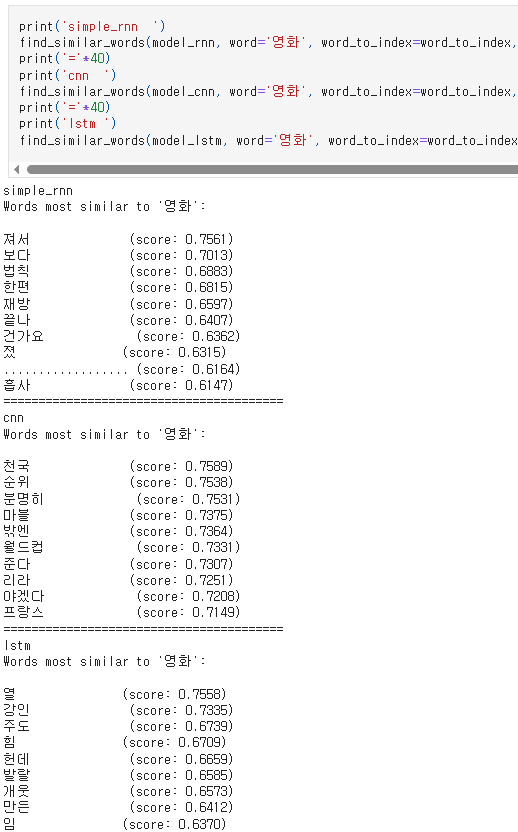

# AIFFEL Campus Online Code Peer Review Templete
- 코더 : 서지연
- 리뷰어 : 김성훈


# PRT(Peer Review Template)
- [x]  **1. 주어진 문제를 해결하는 완성된 코드가 제출되었나요?**
    - 
    - 85.3%로 0.3%p 초과달성
        
    
- [x]  **2. 전체 코드에서 가장 핵심적이거나 가장 복잡하고 이해하기 어려운 부분에 작성된 
주석 또는 doc string을 보고 해당 코드가 잘 이해되었나요?**
    - 
    - 콜백 함수를 사용하여 early stopping으로 불필요한 시간 낭비, 출력 낭비를 예방함.
     
    - 
    - 사전 학습된 임베딩 레이어을 추가 및 LSTM 레이어 구성을 다르게 하며 성능 향상.
    - 층을 줄여 단순화했지만 노드를 늘려 표현력을 키움으로써 성능 향상의 핵심 역할을 한 것으로 보임.

        
- [x]  **3. 에러가 난 부분을 디버깅하여 문제를 해결한 기록을 남겼거나
새로운 시도 또는 추가 실험을 수행해봤나요?**
    - 기존 모델에 임베딩 레이어만 교체하는 것으로는 정확도가 부족한 문제을 모델링 개선으로 해결하였음.
        - "2번"문항에서 언급된 내용과 동일하여 이하 생략.
    
        
- [ ]  **4. 회고를 잘 작성했나요?**

        
- [ ]  **5. 코드가 간결하고 효율적인가요?**
    - 
    - 임베딩 레이어 분석을 위해 키워드를 입력받아 유사도 높은 단어를 추출하는 함수를 만들어 사용.
    - 같은 입력값을 사용하여 함수 실행 코드가 반복되는데 반복문을 사용하는 방법도 있었음. 반복 횟수가 적어서 이번 경우는 굳이 쓸 필요가 없어 보이지만 더 많은 모델을 테스트하는 경우 고려해볼만한 내용이라고 생각합니다.
 

# 회고(참고 링크 및 코드 개선)
```
개인적으로는 모델링 부분에서 너무 작은 변화를 주면서 테스트를 진행하여 시간 소비가 많았습니다. 지연님의 경우 좀 더 과감한 변화를 적용하여 비교적 신속하게 원하는 결과를 얻은 과정을 확인할 수 있었습니다. 2번 문항에서도 언급한 내용이지만 어쩌면 과감하면서도 단순한 접근이 해답이 될 수 있다는 점을 배울 수 있었어 좋았습니다.
```

