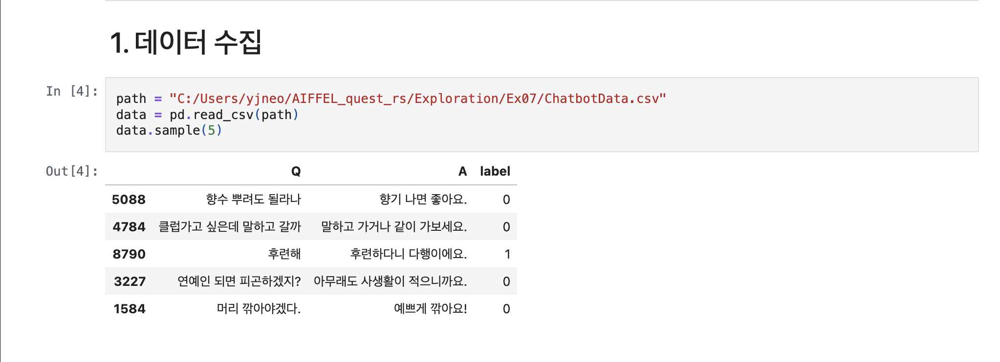
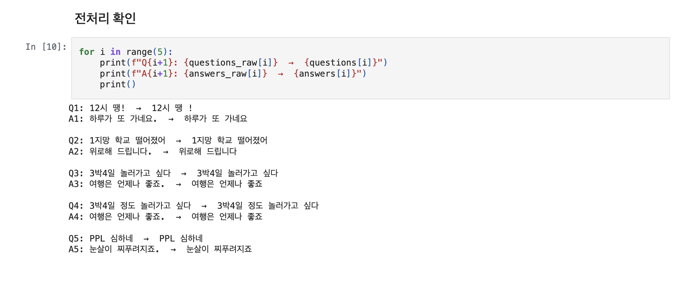
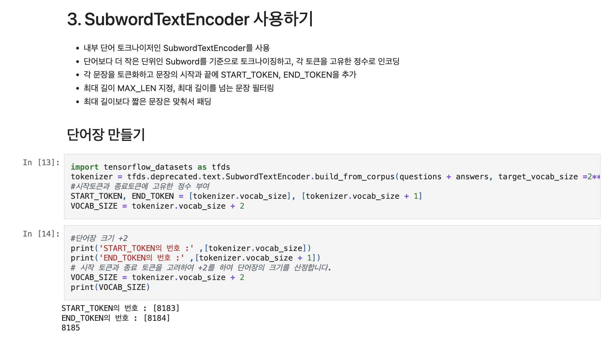
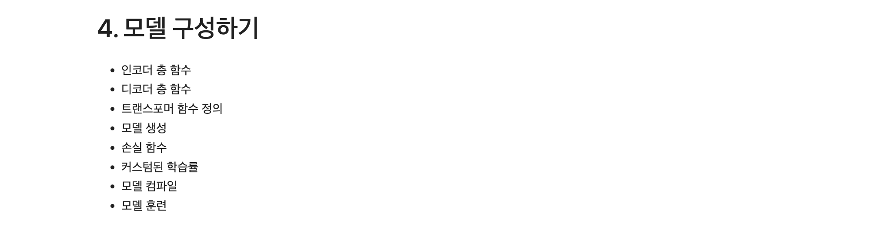
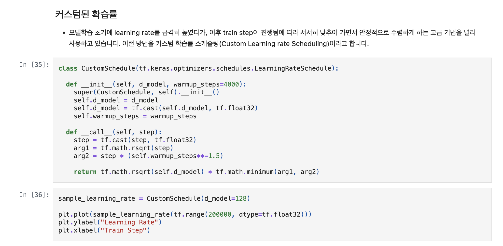
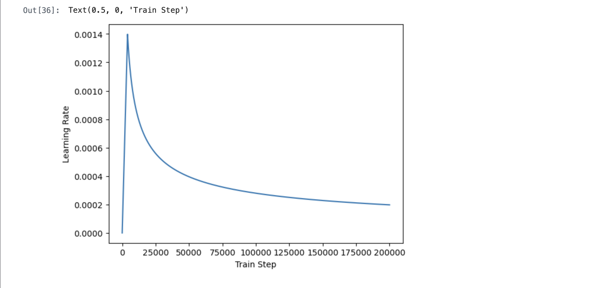
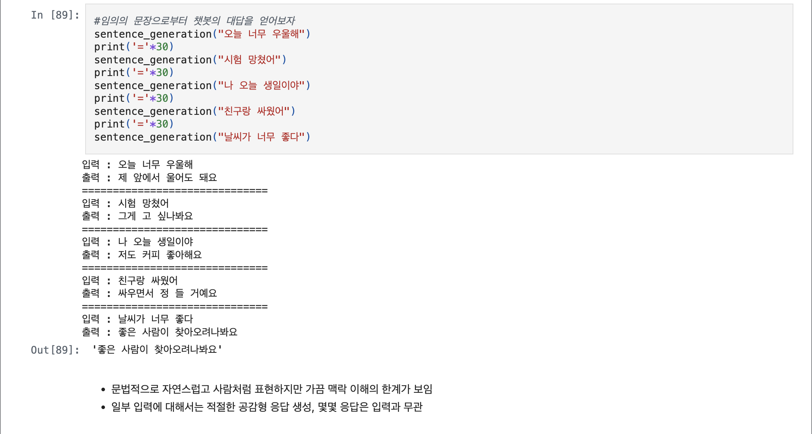
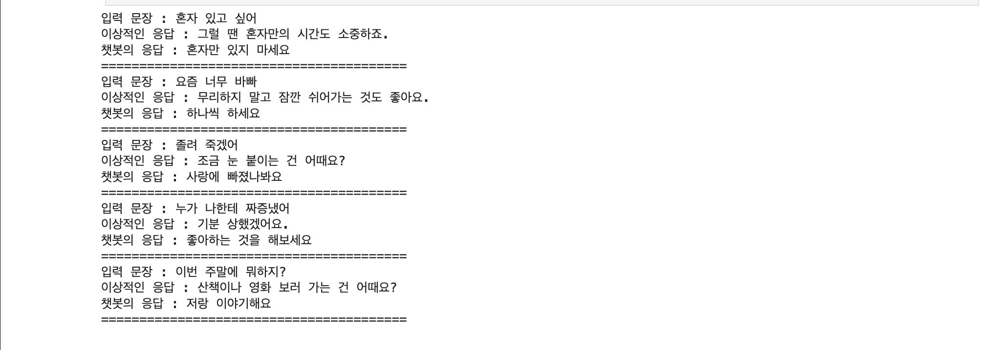
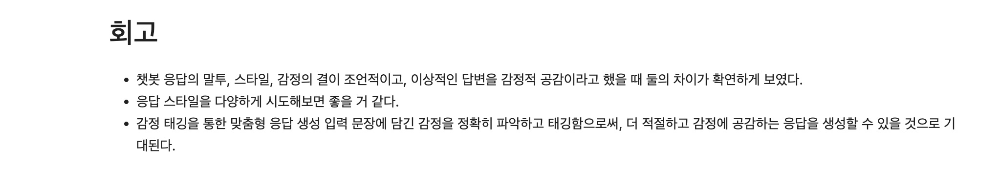
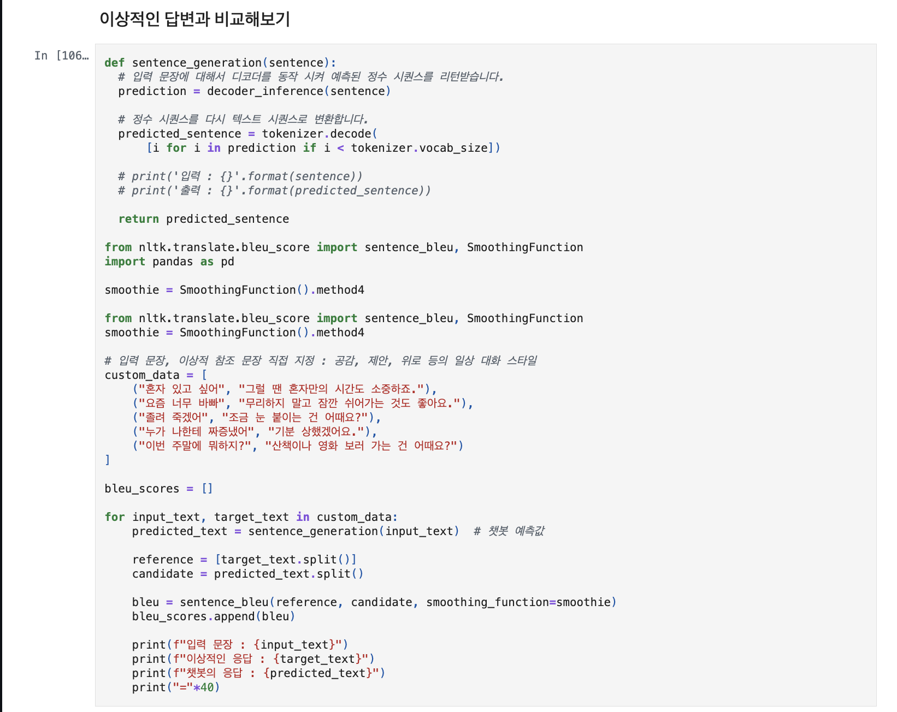

# AIFFEL Campus Online Code Peer Review Templete
- 코더 : 서지연.
- 리뷰어 : 신기성.


# PRT(Peer Review Template)
- [o]  **1. 주어진 문제를 해결하는 완성된 코드가 제출되었나요?**
    - 네 주어진 문제를 해결하는 완성된 코드가 제출 되었습니다.
        
	
	
	
    
- [o]  **2. 전체 코드에서 가장 핵심적이거나 가장 복잡하고 이해하기 어려운 부분에 작성된 
주석 또는 doc string을 보고 해당 코드가 잘 이해되었나요?**
    - 해당 코드 블럭이 핵심적인 이유는 모델 학습 초기의 learning rate을 급격 하게 높였다가, 이후에 training step에서 진행 됨에 따라서서서히 학습 진행 상태를 낮추어가면서 안정성을 수립 하는 기법을 정립 
하였습니다.
    - 네, 해당 코드 블럭에 doc string 은 잘 모르겠지만, 적어도 확실하게 annotation 등이 되어 있는 것을 확인 하였습니다. 
    - 네, 해당 코드의 기능 과 존재 이유에 대해 잘 서술 하였고, 구두로 설명을 잘 하였습니다.
    - 주석은 달려있지 않았지만, 구두로 설명해주신 부분과 인터넷을 찾아서 검색 해보았을때,
이해가 잘 갔던것 같습니다.
        
	
        
- [o]  **3. 에러가 난 부분을 디버깅하여 문제를 해결한 기록을 남겼거나
새로운 시도 또는 추가 실험을 수행해봤나요?**
    - 에러 사항이라기보다는 모델 평가 단계에서 문제 원인 및 해결 과정을 잘 기록하였습니다.
    - 따라서 이에 더해, 프로젝트 평가 기준에 더해 추가적으로 수행한 나만의 시도, 
    실험이 기록되어 있는지 또한 확인을 하였습니다.
        
	
        
- [o]  **4. 회고를 잘 작성했나요?**
    - 네, 주어진 문제를 해결하는 완성된 코드 내지 프로젝트 결과물에 대해
    배운점과 아쉬운점, 느낀점 등이 기록되어 있는 회고를 작성하였습니다.
    - 전체 코드 실행 플로우를 그래프는 아니지만, 각각 다른 모델을 만들어서 비교 하는 걸 보여주었습니다.
        
        
- [ ]  **5. 코드가 간결하고 효율적인가요?**
    - 네, 파이썬 스타일 가이드 (PEP8) 를 준수하고, 코드가 간결하고 효율적으로 잘 구성되어 있습니다.
    - 네, 코드 중복을 최소화하고 범용적으로 사용할 수 있도록 함수화 및 모듈화를 우릭 앞에서 배운
내용을 기반으로 잘 구성하였습니다.
        


# 회고(참고 링크 및 코드 개선)
```
# 리뷰어의 회고를 작성합니다.
# 네,  코드 리뷰 시 참고한 링크는:https://sjh9708.tistory.com/231#google_vignette 와 https://github.com/s-jyeon/AIFFEL_quest_rs/blob/main/Exploration/Ex07/korean_chatbot_training.ipynb 같이 참고하였고, 트랜스포머에 대한 구성 과 설명이 잘 되어있었습니다.
# 코더 께서 조금 더 모델의 성능이향상된 모습을 보고 싶어 이상적인 답변과 챗봇의 응답을 구별하여
보고 하신 모습이 인상 깊었고, 발전 가능성을 보여준것 같아 흥미로웠습니다.
```

