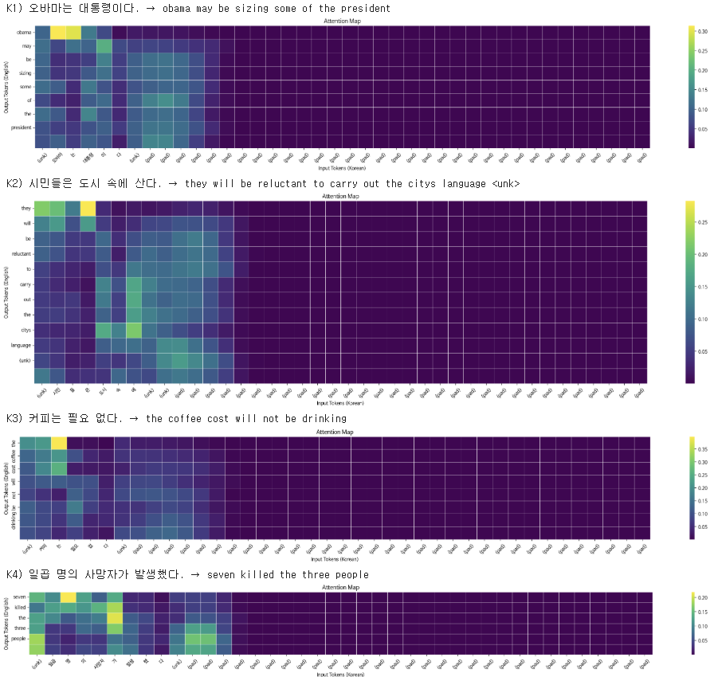
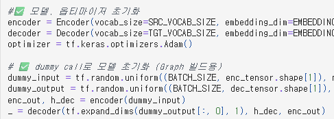
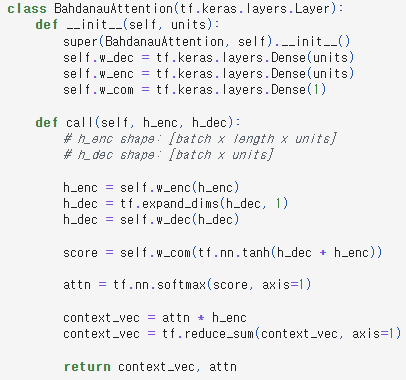

# AIFFEL Campus Online Code Peer Review Templete
- 코더 : 서지연
- 리뷰어 : 오가현


# PRT(Peer Review Template)
- [O]  **1. 주어진 문제를 해결하는 완성된 코드가 제출되었나요?**
    - 문제에서 요구하는 최종 결과물이 첨부되었는지 확인
        - 중요! 해당 조건을 만족하는 부분을 캡쳐해 근거로 첨부</br>
          </br>
          - 가장 중심 단어들은 모두 번역을 잘 했으며, 조금 틀리더라도 문장이 만들어졌고 어텐션맵도 잘 나왔다.
    
- [O]  **2. 전체 코드에서 가장 핵심적이거나 가장 복잡하고 이해하기 어려운 부분에 작성된 
주석 또는 doc string을 보고 해당 코드가 잘 이해되었나요?**
    - 해당 코드 블럭을 왜 핵심적이라고 생각하는지 확인
    - 해당 코드 블럭에 doc string/annotation이 달려 있는지 확인
    - 해당 코드의 기능, 존재 이유, 작동 원리 등을 기술했는지 확인
    - 주석을 보고 코드 이해가 잘 되었는지 확인
        - 중요! 잘 작성되었다고 생각되는 부분을 캡쳐해 근거로 첨부</br>
          </br>
          - 코드에 전체적으로 주석이 달려있어서 해당 코드가 어떤 과정에 해당하는지 보기 좋았다.
        
- [O]  **3. 에러가 난 부분을 디버깅하여 문제를 해결한 기록을 남겼거나
새로운 시도 또는 추가 실험을 수행해봤나요?**
    - 문제 원인 및 해결 과정을 잘 기록하였는지 확인
    - 프로젝트 평가 기준에 더해 추가적으로 수행한 나만의 시도, 
    실험이 기록되어 있는지 확인
        - 중요! 잘 작성되었다고 생각되는 부분을 캡쳐해 근거로 첨부</br>
        </br>
        - 회고 부분에 어떤 문제가 있었는지, 또 어떻게 문제를 해결했는지 작성해두었다.
        - (예를 들면 vocab_size를 늘리면 unk 토큰이 발생하지 않는 것)
        
- [O]  **4. 회고를 잘 작성했나요?**
    - 주어진 문제를 해결하는 완성된 코드 내지 프로젝트 결과물에 대해
    배운점과 아쉬운점, 느낀점 등이 기록되어 있는지 확인
    - 전체 코드 실행 플로우를 그래프로 그려서 이해를 돕고 있는지 확인
        - 중요! 잘 작성되었다고 생각되는 부분을 캡쳐해 근거로 첨부</br>
        </br>
        - 해당 과제를 통해 알게 된 부분을 잘 적어두었다.
        
- [O]  **5. 코드가 간결하고 효율적인가요?**
    - 파이썬 스타일 가이드 (PEP8) 를 준수하였는지 확인
    - 코드 중복을 최소화하고 범용적으로 사용할 수 있도록 함수화/모듈화했는지 확인
        - 중요! 잘 작성되었다고 생각되는 부분을 캡쳐해 근거로 첨부</br>
        </br>
        - 전체적으로 함수화가 잘 되어 있으며 들여쓰기 등도 보기 편하게 잘 되어있다.


# 회고(참고 링크 및 코드 개선)
```
# 리뷰어의 회고를 작성합니다.
# 코드 리뷰 시 참고한 링크가 있다면 링크와 간략한 설명을 첨부합니다.
# 코드 리뷰를 통해 개선한 코드가 있다면 코드와 간략한 설명을 첨부합니다.
```
이번 리뷰 조에서 성능이 제일 잘 나왔으며, 번역도 중심 단어는 잘 캐치하는 등 짧은 시간에 진행한 프로젝트임에도 준수한 성과를 보였다고 생각합니다. 추후에 제 코드도 지연님의 코드를 참고해서 고쳐보면 좋을 것 같습니다. 뿐만 아니라 지연님은 항상 결과 및 회고를 보기 좋게 정리해주셔서 저도 그렇게 해야겠다고 생각하면서 많이 배워갑니다. :)
